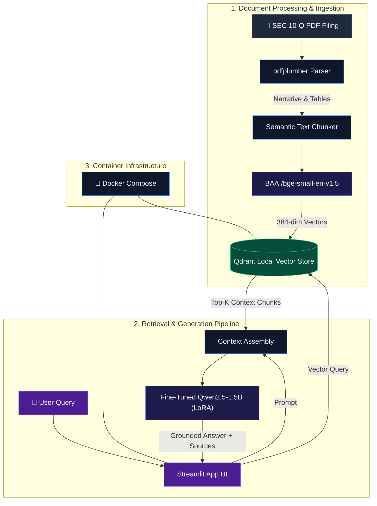

# FinDocIQ: Financial Statement RAG Assistant

[](https://www.python.org/)
[](https://pytorch.org/)
[](https://qdrant.tech/)
[](https://www.docker.com/)
[](LICENSE)

**FinDocIQ** is an end-to-end Retrieval-Augmented Generation (RAG) assistant engineered to ingest, parse, and query complex SEC 10-Q financial filings. Built to eliminate financial hallucinations and structural data breakdown, FinDocIQ preserves narrative context and financial table structures to deliver factually grounded answers with clear source attribution.

---

## Key Features

* **Advanced PDF & Table Extraction:** Uses `pdfplumber` to cleanly parse narrative disclosures and multi-column financial tables without breaking tabular integrity.
* **Local Vector Search:** Embeds text chunks using `BAAI/bge-small-en-v1.5` and indexes them into a local **Qdrant Vector Database** for high-density similarity search.
* **Fine-Tuned Local Inference:** Leverages **Qwen2.5-1.5B** fine-tuned via PEFT/LoRA for targeted, context-grounded financial Q&A.
* **Interactive Streamlit UI:** Features dynamic Top-K chunk retrieval tuning, real-time citation/source text inspection, and one-click pipeline cache clearing.
* **Production Containerization:** Optimized CPU-only PyTorch setup packaged with **Docker Compose** and BuildKit layer caching for efficient local or cloud deployment.

---

## System Architecture



---

## Tech Stack

| Domain | Technologies Used |
| :--- | :--- |
| **Language & Core** | Python 3.10, PyTorch (CPU-Optimized) |
| **LLM & Fine-Tuning** | Qwen2.5-1.5B, Hugging Face Transformers, PEFT (LoRA) |
| **Embeddings & Vector Store** | `BAAI/bge-small-en-v1.5`, Qdrant Vector Store |
| **Document Processing** | `pdfplumber`, Pandas, NumPy |
| **Frontend UI** | Streamlit |
| **DevOps & Containerization** | Docker, Docker Compose, BuildKit Cache Mounts |

---

## Project Structure

```text
FinDocIQ/
├── data/                    # Storage for raw PDF filings and Qdrant local database snapshots
├── src/
│   ├── ingestion.py         # Advanced PDF parsing (pdfplumber) and semantic chunking logic
│   ├── vector_store.py      # Qdrant vector database initialization, indexing, and search
│   └── rag_engine.py        # Context retrieval assembly and fine-tuned Qwen model inference
├── app.py                   # Interactive Streamlit frontend web application
├── Dockerfile               # Multi-stage layer-cached Docker build file (CPU-only PyTorch)
├── docker-compose.yml       # Container orchestration (Streamlit application + Qdrant service)
├── .env.example             # Template for environment variables
├── requirements.txt         # Dependency manifest with PyTorch CPU index URL
└── README.md
```

---

## Configuration & Environment Setup

Copy `.env.example` to create your local `.env` configuration file:

```bash
cp .env.example .env
```

Default configuration settings:

```env
# Vector Database Settings
QDRANT_HOST=localhost
QDRANT_PORT=6333
COLLECTION_NAME=financial_docs

# Embedding & LLM Models
EMBEDDING_MODEL_NAME=BAAI/bge-small-en-v1.5
LLM_MODEL_NAME=Qwen/Qwen2.5-1.5B-Instruct
LORA_WEIGHTS_PATH=./models/qwen-lora-financial

# Application Settings
CHUNK_SIZE=500
CHUNK_OVERLAP=50
DEFAULT_TOP_K=3
```

---

## Technical Deep Dive

### 1. Structure-Preserving Document Ingestion
Financial disclosures interweave dense narrative paragraphs with financial tables. Standard text extractors destroy table relationships by reading across columns. FinDocIQ utilizes `pdfplumber` to explicitly detect bounding boxes around tabular data, converting balance sheets and income statements into Markdown tables before splitting text into semantic chunks.

### 2. High-Density Vector Indexing
* **Embedding Model:** `BAAI/bge-small-en-v1.5` mapping text chunks into a 384-dimensional vector space.
* **Similarity Metric:** Cosine Similarity indexed inside a local **Qdrant** instance.
* **Payload Metadata:** Each vector stores chunk text, original page number, table flags, and file source metadata for instant citation tracking.

### 3. Fact-Grounded LLM Generation
* **Model Base:** `Qwen2.5-1.5B-Instruct` lightweight open-weights LLM optimized for CPU inference.
* **Fine-Tuning Method:** Low-Rank Adaptation (**LoRA** via `peft`) trained to restrict answers strictly to provided context windows and formulate structured responses.

---

## Quick Start Guide

### Option A: Running with Docker Compose (Recommended)

Ensure [Docker](https://www.docker.com/get-started/) and [Docker Compose](https://docs.docker.com/compose/) are installed.

1. **Clone the repository:**
   ```bash
   git clone [https://github.com/Harshal19t/FinDocIQ-.git](https://github.com/Harshal19t/FinDocIQ-.git)
   cd FinDocIQ-
   ```

2. **Launch with Docker BuildKit caching enabled:**
   * **Linux / macOS:**
     ```bash
     DOCKER_BUILDKIT=1 docker compose up --build
     ```
   * **Windows (PowerShell):**
     ```powershell
     $env:DOCKER_BUILDKIT=1; docker compose up --build
     ```

3. **Access the Application:**
   Open your browser at `http://localhost:8501`.

---

### Option B: Local Python Virtual Environment

If running outside Docker:

1. **Create and activate virtual environment:**
   ```bash
   python -m venv venv
   source venv/bin/activate  # On Windows: .\venv\Scripts\activate
   ```

2. **Install CPU-only PyTorch and dependencies:**
   ```bash
   pip install --extra-index-url [https://download.pytorch.org/whl/cpu](https://download.pytorch.org/whl/cpu) -r requirements.txt
   ```

3. **Run local Qdrant container:**
   ```bash
   docker run -p 6333:6333 -p 6334:6334 qdrant/qdrant
   ```

4. **Start Streamlit App:**
   ```bash
   streamlit run app.py
   ```

---

## Testing & Verification

Run this command inside the running container to verify CPU-only PyTorch installation and ensure CUDA overhead is completely stripped:

```bash
docker compose exec app python -c "import torch; print('PyTorch Version:', torch.__version__); print('CUDA Available:', torch.cuda.is_available())"
```

**Expected Output:**
```text
PyTorch Version: 2.2.0+cpu
CUDA Available: False
```

---

## Usage Walkthrough

1. **Upload Filing:** Drag and drop an SEC 10-Q report (PDF) using the sidebar file loader.
2. **Ingest & Vectorize:** Click **Process Document** to execute `pdfplumber` parsing, chunking, embedding generation, and Qdrant database population.
3. **Query Financials:** Enter questions such as *"What were total operating expenses for the quarter?"* or *"Summarize legal proceedings disclosed in the report."*
4. **Audit Citations:** Open the **Retrieved Context** drawer below any response to inspect the exact text chunks and page references used by the LLM.

---

## Future Roadmap

- [ ] **Hybrid Search Integration:** Combine dense vector search with sparse BM25 keyword matching for exact numerical code lookups.
- [ ] **RAGAS Evaluation Framework:** Automated scoring for faithfulness, answer relevance, and context recall.
- [ ] **FastAPI Backend Layer:** Expose RESTful endpoints for integration into external microservices.

---

## Author

**Harshal Trivedi**
* **Education:** MSc Advanced Computer Science, University of Sheffield
* **GitHub:** [@Harshal19t](https://github.com/Harshal19t)
* **LinkedIn:** [Harshal Trivedi](https://linkedin.com/in/harshal-trivedi-702145208)

---

## License

This project is licensed under the MIT License - see the [LICENSE](LICENSE) file for details.
